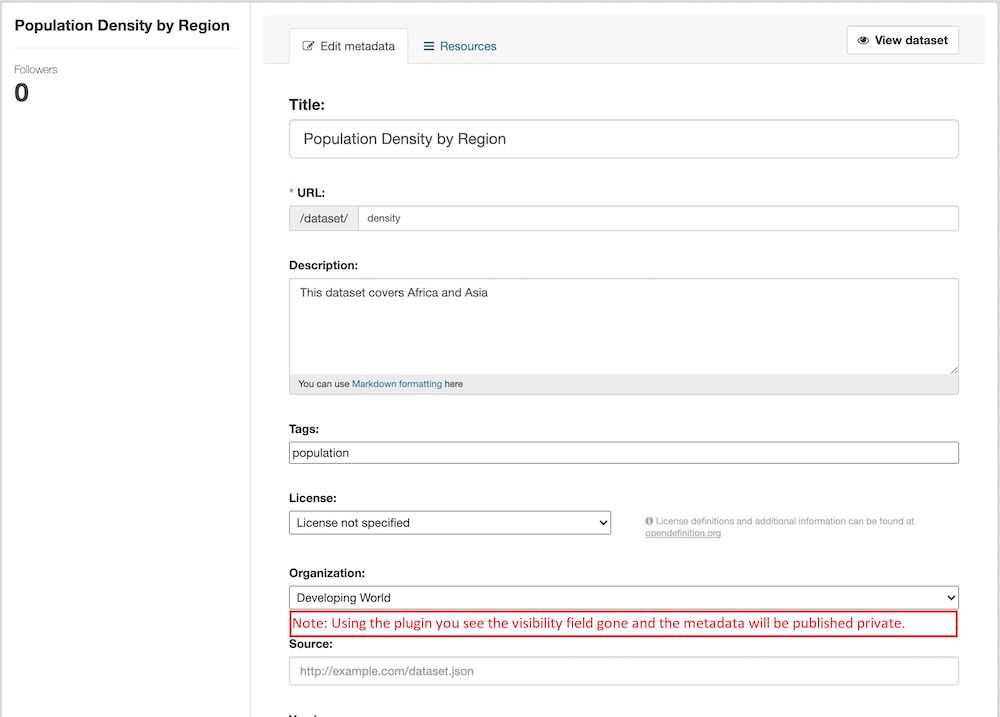

ckanext-publisher
=====================================

|
|

**ckanext-publisher** plugin facilitate the user to publish metadata by default private.

By not use of the plugin there is field visibility where user set manually the option of  **public** or **private**.

|
|

**Image Below**: The plugin removes the visibility field so that it can only be set by an **admin**.

|
|

**In the image below**: By using the plugin the metadata created is set to **private** automatically.

.. image:: docs/img/package_publish.jpg
    :alt: Publish dataset

|
|

**In the image below**: If you are an admin you can set the visibility of the metadata either **public** or **private**.

|
|

**Member**
**Editor**
**Admin**

1. A member is a registered user of the platform and can:
    * browse the platform
    * view all published and unpublished datasets

2. An editor is a registered user of the platform and can:
    * view all published datasets
    * view unpublished datasets in assigned organization
    * **create, modify, delete or move the datasets in owned organizations**
    * **cannot publish or unpublish dataset**

3. An admin is a registered user of the platform and can:
    * view all published datasets
    * view unpublished datasets in assigned organization
    * create, modify, delete or move the datasets between owned organizations
    * **create a public dataset**
    * **manage the datasets visibility by publisher or unpublisher it.** manage the organization by adding existing users (as Editor or Admin)

|

Requirements
------------

Before installing ckanext-publisher, make sure that you have installed the following:

* CKAN 2.8+

Installation
------------

To install ckanext-publisher:

1. Activate your CKAN virtual environment, for example::

     . /usr/lib/ckan/default/bin/activate

2. Install the ckanext-publisher Python package into your virtual environment::

     pip install ckanext-publisher

3. Add ``ckanext-publisher`` to the ``ckan.plugins`` setting in your CKAN
   config file (by default the config file is located at
   ``/etc/ckan/default/production.ini``).

4. Restart CKAN. For example if you've deployed CKAN with Apache on Ubuntu::

     sudo service apache2 reload

Configuration
-------------

You must make sure that the following is set in your CKAN config::

    ckan.auth.create_unowned_dataset = false
    ckan.auth.create_dataset_if_not_in_organization = false
    ckan.plugins = publisher ...

Development
-----------

To install ckanext-publisher for development, activate your CKAN virtualenv and do::

    git clone https://bitbucket.org/cioapps/ckanext-publisher.git
    cd ckanext-publisher
    python setup.py develop

Tests
-----

To run the tests:

1. Activate your CKAN virtual environment, for example::

     . /usr/lib/ckan/default/bin/activate

2. From the CKAN root directory (not the extension root) do::

    pytest --ckan-ini=test.ini ckanext/publisher/tests

